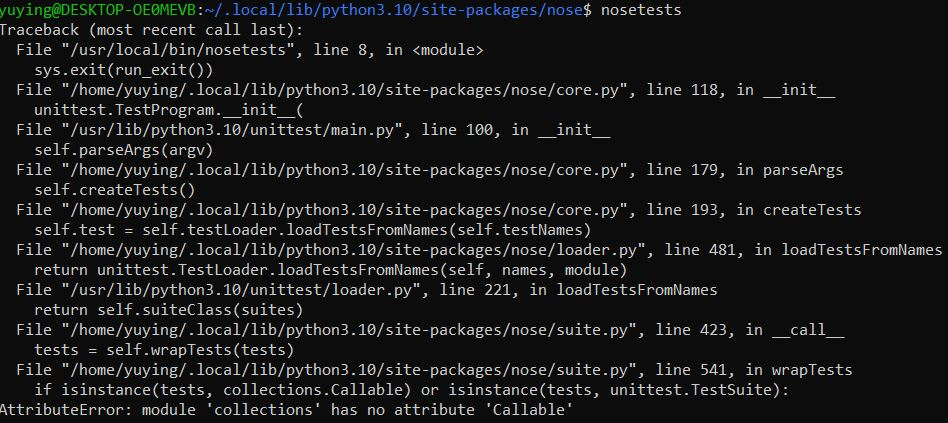
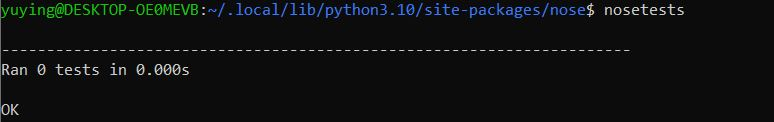
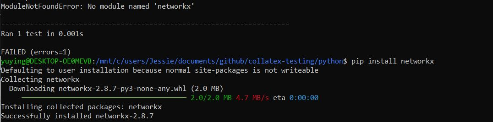

# Run NOSE on Ubuntu

## Why to edit this note?

I edit this note because I meet some problems when I run Nose with git bash or Ubuntu for the first time.

After installing nose by running `pip install nose` , I run `nosetests` or `nosetests --version `, and bash returns `bash: nosetests: command not found`. It seems that the installation failed. Ubuntu also return the same error.

This note also includes other problems `AttributeError` and `ModuleNOTFoundError` when I running `nosetests` after that Ubuntu can locate Nose.

## How to solve the problems

I try to install Nose on Ubuntu because it is confusing that how Windows can locate Nose.

### Installation

- run `sudo pip install nose` to install Nose

### Locate Nose we installing

Ubuntu does not visit the default file path to Nose when we run `nosetests`, so we need to copy the directory of Nose to `/usr/local/bin`.

- run `sudo pip install nose` again to get the file path to Nose
  - In my case, I get `Requirement already satisfied: nose in /usr/local/lib/python3.10/dist-packages (1.3.7)`. 
  -  `/usr/local/lib/python3.10` is the file path to Nose.
- Navigate to the file path to Nose
  - In my case, I run  `cd /usr/local/lib/python3.10`.
- Run `ls` to list what we have in this directory
  - In my case, I have got two directories `nose` and `nose-1.3.7.dist-info`
- Run `cp nose /usr/local/bin` to copy the directory of Nose to `usr/local/bin`[*[source]*](https://www.cnblogs.com/meina/p/13570416.html)
  - Thus, Nose can be found by Ubuntu.

### Attribute Error

- Run `nosetests` now
  - We might meet another problem  `AttributeError: module 'collections' has no attribute 'Callable'`

  - In this image, we can see the error is in suite.py.

    

- Run `cd nose`

- Run `sudo nano suite.py`

- Press `ctrl` + `\` to replace all `collections.Callable` to `collections.abc.Callable` [*[source]*](https://stackoverflow.com/questions/69515086/error-attributeerror-collections-has-no-attribute-callable-using-beautifu)

- Press`ctrl` +`x` , press `y` , and press `Enter` to save the change

- Run `nosetests` and continue to replace `collections.Callable` in other python scripts

- When all `collections.Callable` are replaced to `collections.abc.Callable`,  it is OK to do test.

  

### Module NOT Found Error

Run `nosetests <file_name.py>` in project directory, we might get module not found error as shown in the image below. We need to install all modules not found with `Run pip install <module_name>`.

