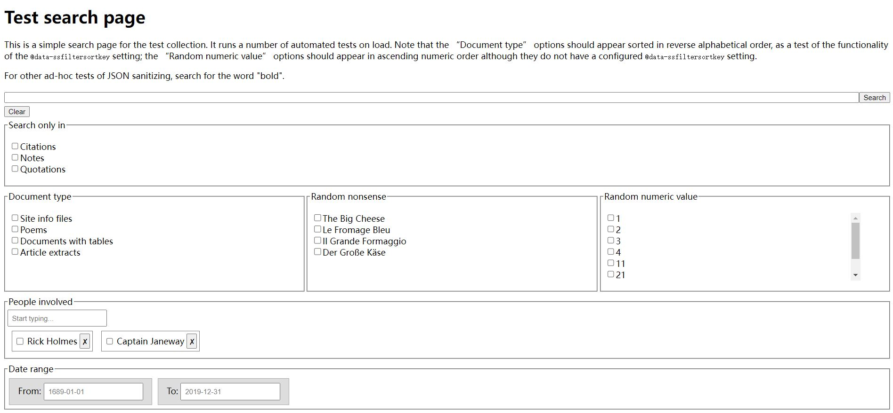

# staticSearch on Windows

## What is staticSearch?

staticSearch can generate a search page for a site without back-end servers (database, etc.). [*learn more*](https://endings.uvic.ca/staticSearch/docs/whatDoesItDo.html)

The search page looks like below:

## How to use on Windows?

### Preparation

1. Install [Apache Ant](https://ant.apache.org/bindownload.cgi)

2. Install [Ant Contrib](https://sourceforge.net/projects/ant-contrib/files/ant-contrib/)
   - Move `ant-contrib-1.0b3.jar` to `/lib` of Ant
   
3. Install WSL (Windows Subsystem for Linux)

    Since we cannot run staticSearch on Windows machines directly, we need to use WSL run Linux system on Windows machines.

    - Click on Start and search **Windows PowerShell**, right-click it and select **Run as administrator** option.
      - If you would like a default distribution, you can: 
        - Run `wsl --install` 
      - If you want a specific distribution, you can:
        - Run `wsl --list --online` to get a list of WSL distributions
        - Run `wsl --install Ubuntu`
          - You can replace `Ubuntu` to any other distribution in the list.
    - Restart your computer

### Configuring Linux environment

1. Open **Ubuntu shell**
2. Set your username and password
3. Update all available packages to install
   - Run `sudo apt update`

4. Install JAVA
   - Run `sudo apt install default-jdk`

5. Locate and record the file path to Ant installation on Windows

   - On my computer, it's `C:\ProgramData\chocolatey\lib\ant\tools\apache-ant-1.10.12`

   - Replace all `\` to `/` and replace `C:` to `/mnt/c` 

   - Now, it should be like `/mnt/c/ProgramData/chocolatey/lib/ant/tools/apache-ant-1.10.12`

6. Locate and record the file path to JAVA on Linux
   - On my computer, it's `/usr/lib/jvm/java-1.11.0-openjdk-amd64`

7. Set environment variables

   - Run `sudo nano /etc/environment`

   - Add a variable `ANT_HOME` and set its value as the file path to ANT
     - E.g. `ANT_HOME="/mnt/c/ProgramData/chocolatey/lib/ant/tools/apache-ant-1.10.12"`

   - Add  a variable `JAVA_HOME` and set its value as the file path to JAVA you recording
     - E.g. `JAVA_HOME="/usr/lib/jvm/java-1.11.0-openjdk-amd64"`

   - Press `ctrl` + `X` and press `Enter` to save changes

   - Run `source /etc/environment` to reflect changes

## Create a static search page

1. Download the [package](https://github.com/projectEndings/staticSearch/releases/), or clone the [repository](https://github.com/projectEndings/staticSearch) of staticSearch in **Git Bash**
2. In **Ubuntu Shell**, navigate to staticSearch repository
3. Run `ant` 
4. Run `cd test`
5. Run `python3 -m http.server 8000` and jump to `localhost:8000` on a web browser
6. Click on the link `search.html` in the first paragraph and search something freely

